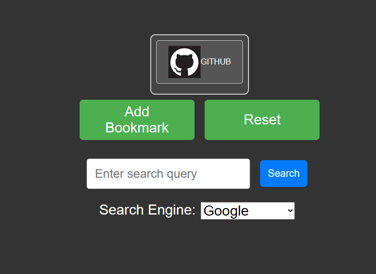

# Kitzurit

Kitzurit is a versatile web application that combines the functionality of a shortcut and custom bookmark maker with a search engine for Google, Bing, and DuckDuckGo. It provides a convenient way to create and manage your favorite shortcuts and bookmarks while also offering a seamless search experience.

## Features

- **Shortcut and Bookmark Maker**: Create custom shortcuts and bookmarks for your frequently visited websites or web applications. Easily organize and access them from a centralized location.

- **Search Engine Integration**: Kitzurit integrates with popular search engines like Google, Bing, and DuckDuckGo, allowing you to perform searches directly from the application.

- **Customizable**: Personalize your shortcuts and bookmarks with custom icons, names, and descriptions to suit your preferences.

- **Cross-Platform Compatibility**: Access Kitzurit from any modern web browser, ensuring a consistent experience across different devices and platforms.

## Demo

Here's a demonstration of how Kitzurit looks:

## Getting Started

To start using Kitzurit, simply visit the website at [https://github.com/abduznik/Kitzurit/deployments/github-pages](https://github.com/abduznik/Kitzurit/deployments/github-pages). No installation or setup is required; you can start creating shortcuts, bookmarks, and performing searches right away.

